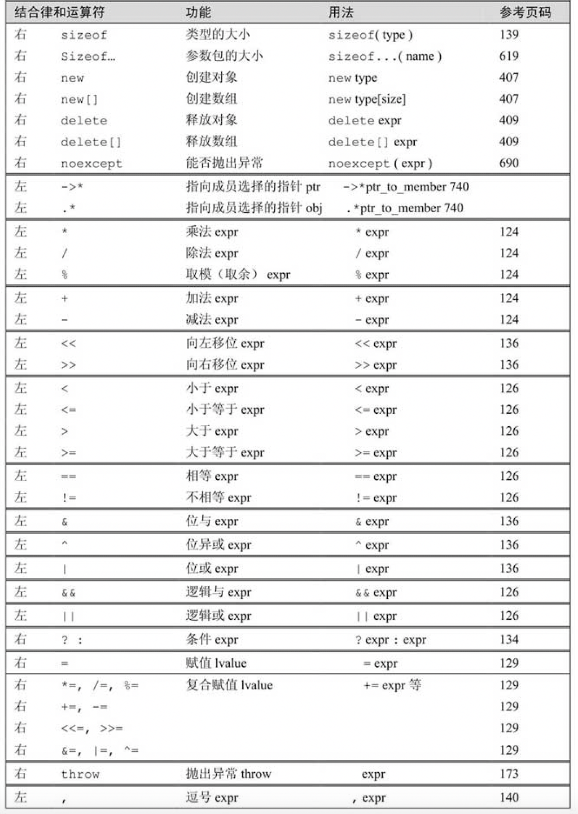

## 算术运算符
- **溢出**：当计算的结果超出该类型所能表示的范围时就会产生溢出
- **bool类型不应该参与计算**
  ```cpp
  bool b=true;
  bool b2=-b;   //仍然为true
  //b为true，提升为对应int=1，-b=-1
  //b2=-1≠0，所以b2仍未true
  ```
- 取余运算m%n，结果符号与m相同

## 逻辑运算符

- **短路求值**：逻辑与运算符和逻辑或运算符都是先求左侧运算对象的值再求右侧运算对象的值，当且仅当左侧运算对象无法确定表达式的结果时才会计算右侧运算对象的值。**先左再右**
- 小技巧，声明为引用类型可以避免对元素的拷贝，如下，如string特别大时可以节省大量时间
    ```cpp
    vector<string> text;
    for(const auto &s: text){
      cout<<s;
    }
    ```

## 赋值运算符

- 赋值运算的**返回结果是它的左侧运算对象**，且是一个左值。类型也就是左侧对象的类型
- 如果赋值运算的左右侧运算对象类型不同，则右侧运算对象将转换成左侧运算对象的类型
- 赋值运算符满足**右结合律**，这点和其他二元运算符不一样。 `ival = jval = 0;`等价于`ival = (jval = 0);`
- 赋值运算优先级比较低，使用其当条件时应该加括号
- 复合赋值运算符，**复合运算符只求值一次**，普通运算符求值两次。（对性能有一点点点点影响）
  任意复合运算符op等价于`a = a op b;`

## 递增递减运算符

* 前置版本`j = ++i`，先加一后赋值
* 后置版本`j = i++`，先赋值后加一

**优先使用前置**版本，后置多一步储存原始值。（除非需要变化前的值）

### 混用解引用和递增运算符

`*iter++`等价于`*(iter++)`，递增优先级较高

```c++
auto iter = vi.begin();
while (iter!=vi.end()&&*iter>=0)
	cout<<*iter++<<endl;	// 输出当前值，指针向前移1
```

> **简介是一种美德**，追求简洁能降低程序出错可能性

## 成员访问运算符

`ptr->mem`等价于`(*ptr).mem`

注意`.`运算符优先级大于`*`，所以记得加括号


## 条件运算符
- 可以嵌套使用，**右结合律**，从右向左顺序组合
  - ```c++
    finalgrade = (grade > 90) ? "high pass"
        : (grade < 60) ? "fail" : "pass";
    //等价于
    finalgrade = (grade > 90) ? "high pass"
        : （(grade < 60) ? "fail" : "pass"）;
    ```

## 位运算符
- 有符号数负值可能移位后变号，所以强烈建议**位运算符仅用于无符号数**。
- 位运算符满足左结合律，优先级介于中间，使用时尽量加括

## 逗号运算符

从左向右依次求值

左侧求值结果丢弃，逗号运算符**结果是右侧表达式**的值
```c++
    int a = (1 * 1, 1* 2, 1 * 3);
    std::cout << a << std::endl;
```
```
3
```

## 类型转换

### 隐式类型转换
- 在大多数表达式中，比int类型小的整型值首先提升为较大的整数类型
- 在条件中，非布尔值转换成布尔类型
- 初始化过程中，初始值转换成变量的类型；在赋值语句中，右侧运算对象转换成左侧运算对象的类型
- 如果算术运算或关系运算的运算对象有多种类型，需要转换成同一种类型
- 函数调用时也会发生类型转换

### 显式类型转

- **static_cast**：任何明确定义的类型转换，只要不包含底层const，都可以使用。 `double slope = static_cast<double>(j);`
- **dynamic_cast**：支持运行时类型识别。
- **const_cast**：只能改变运算对象的底层const，一般可用于去除const性质。 `const char *pc; char *p = const_cast<char*>(pc)`
  > 只有其可以改变常量属性
- **reinterpret_cast**：通常为运算对象的位模式提供低层次上的重新解释

## 运算符优先级

