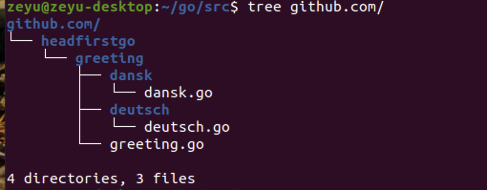

## Go工作区
- bin，保存已编译的二进制可执行程序
- pkg，保存已编译的二进制包文件
- src，保存Go的源代码

在src中，每个包的代码都位于它自己单独的子目录中。按照惯例，子目录名应该与包名相同


## 导出包

import的是src下的路径,src下同一级目录只能有一个package,但是可以创建子目录嵌套package(使用域名和路径来确保包导入路径是唯一的)

- 包名应全部为小写
- 如果含义相当明显，名称应该缩写(如fmt)
- 如果可能的话，应该是一个词。如果需要两个词，不应该用下划线分隔，第二个词也不应该大写(strconv包就是一个例子)
- 导入的包名可能与本地变量名冲突，所以不要使用包用户可能也 想使用的名称(例如，如果fmt包被命名为format，那么导入该包的任何人如果把一个局部变量也命名为format，则将面临冲突的风险)
- 导出的函数首字母大写

## 常量

- 使用const关键字而不是var关键字
- 必须在声明常量时赋值;不能像变量那样以后赋值
- 变量有:=短变量声明语法，但是常量没有等效的语法

`const rc = 5` 可以省略类型

与变量和函数一样，名称以大写字母开头的常量是可导出的

## go install 
go install + main package的目录

可执行文件被安装到工作目录下bin子目录

## 发布
例如 (https://github.com/headfirstgo/greeting)

用包所在的URL部分来命名每个子目录

go get 下载和安装包

```sh
go get github.com/headfirstgo/greeting
```



## 文档
go doc `导入路径` 

go doc `导入路径` `函数名` 

go doc解析的是代码注释(包注释+函数注释)

- 注释应该是完整的句子
- 包注释应以`Package`开头，后跟包名,注释一般放在package关键字之前
- 函数注释应以它们描述的函数的名称开头,注释一般放在函数之前

### 本地html文档

```sh
sudo apt install golang-golang-x-tools
godoc -http=:6060
```
网站打开`http://localhost:6060/pkg/`看到机器上安装的所有包的列表


